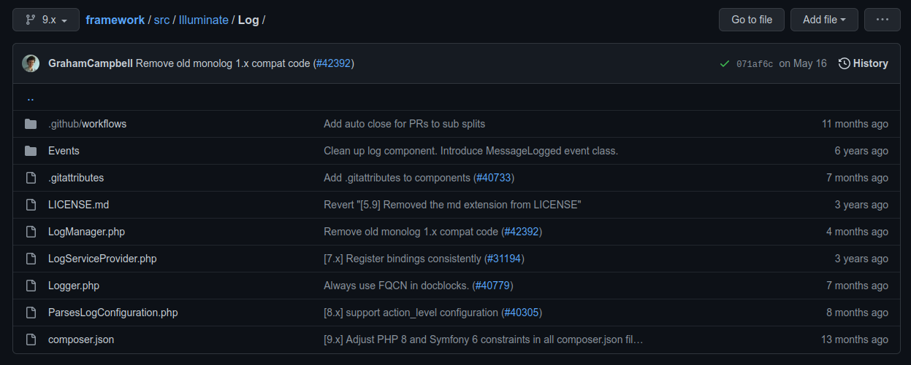

# Facade :classical_building:

Facade is a structural design pattern that provides a simplified interface to a library, a framework, or any other complex set of classes. [Theory](https://refactoring.guru/design-patterns/facade).

> Before you continue, take a look [how Laravel implemented Facade](./IMPLEMENTATION.md) in the framework.

## Table of Contents

1. [Log](#1-log)

## 1. Log

> Facade: [src/Illuminate/Support/Facades/Log.php](https://github.com/laravel/framework/blob/5cc435df7a99231b1504f100c9f55e44a08bd210/src/Illuminate/Support/Facades/Log.php)

> Complex Subsystem: [src/Illuminate/Log](https://github.com/laravel/framework/blob/5cc435df7a99231b1504f100c9f55e44a08bd210/src/Illuminate/Log)

Laravel provides a simplified interface to a set of classes responsible for logging using a Facade. Whenever a developer calls `Illuminate\Support\Facades\Log::info()`, the method actually forwards a call to `Illuminate\Log\LogManager::info()` method.

